# 텍스트 데이터 분석 내용정리 1편

```
문제 유형
-- Week 01, Week 04, Week 08 제외 전 범위

(개념)
1. Handling Text Files (Week 02)
2. Text Preprocessing  (Week 03)
3. Frequency Analysis (Week 05)
4. Topic Modeling (Week 09)
5. Deep Learning for Text Data (15) (Week 10,12,13,14)

(코드개념)
1. Document Classfication & Sentiment Analysis (15) (Week 7)

(풀이)
Document Classfication & Sentiment Analysis (Week 06, 07)

Neural Network & Word Embedding (20) (Week 10,11)
-- 손으로 직접 계산하여 푸는 문제
```

Self-Assessment

```
Text Mining, Corpus, Tokenizing, TF-IDF, Transformer

Word Cloud, Sentiment Analysis, Topic Modeling, Word2Vec, BERT
```

## Week02: Handling Text Files

### 1. 텍스트 파일

```
- Plain Text File (Text File): **텍스트 데이터만 포함**하는 파일로 메모장에서 편집 가능한 파일이면 Plain Text File이라고 보면 됨

- Binary Text File(Binary File): **비 텍스트 데이터도 포함**하는 파일, 처리를 위해 한글, 엑셀 등 전용 프로그램이 필요함
```

### 2. Text Encoding

```
- Encoding: 문자를 컴퓨터가 이해할 수 있는 부호로 부호화 하는 것
- Decoding: 컴퓨터 부호를 사람이 이해할 수 있는 문자로 복호화하는 것

UTF-8: 유니코드를 실제로 사용할 때 기존 SW환경과의 호환성을 유지할 수 있도록 만들어진 문자 부호와 방식

- BOM(Byte Order Mark)가 있는 경우와 없는 경우가 존재
- BOM 없는 UTF-8이 사실상의 텍스트 인코딩 표준
```

### 3. Text File Types

```
- 정형 텍스트 파일: CSV, TSV 파일 등
- 비정형 텍스트 파일: 신문기사, 소설, 소셜 미디어 포스팅 등
- 반정형 텍스트 파일: HTML, XML, JSON 등
```

### 4. 정형 텍스트 파일의 처리(파일 읽기 및 행 구분)
```
- CSV 파일은 각 필드에 큰 따옴표("")로 감싸져 있음.
- 파일의 첫 줄은 필드명을 나타내는 헤더
- CSV 파일에서 각 행은 new line으로 구분되며, 각 열은 콤마로 구분됨

- 파일을 열 때에는 open() 함수를 사용(행 단위 읽기)
- 행 바꿈 문자는 읽어온 행의 끝에 붙어있음 (strip()으로 제거)

- 전체 파일을 읽은 후 행 단위 분할 -> read(), splitlines()로 각 행을 구분

- csv파일은 csv 모듈의 reader() 함수 사용하여 각 열의 분절을 자동으로 수행하여 리스트로 저장 혹은 DictReader() 함수로 리스트 내의 딕셔너리로 저장
```

## Week03: Text Preprocessing

```
WEEK HW: 문서로부터 주요 품사 고빈도 어휘 출력
```

텍스트 전처리: 텍스트에서 불필요한 부분을 제거하고, 문장을 표준 단어로 분리하고, 각 단어의 품사를 파악하는 일련의 과정

- **토큰화, 정제, 정규화, 품사 태깅 등**으로 구성

### 1. 토큰화

```
- 주어진 텍스트를 단위(Token)으로 구분하는 작업

1) 문장 토큰화
2) 단어 토큰화
3) 정규표현식을 이용한 토큰화
4) 노이즈와 불용어 제거
```

### 2. 정제

```
- 분석에 불필요한 노이즈를 제거하는 과정
- 토큰화 이전 및 이후에 수행

- 정제 대상
1) 특수문자 등의 노이즈 -> 토큰화 과정에서 대부분 삭제됨
2) 길이가 너무 짧은 단어 -> 정규 표현식으로 삭제 가능
3) 실제 사용되는 단어이지만 별 의미가 없는 단어 -> 불용어 사전 활용
4) 분석의 목표 관점에서 불필요한 단어 -> 불용어 사전을 정의하여 사용
```

### 3. 정규화

```
- 단어의 다양한 변형을 원형의 형태로 통일하는 작업

- 어간 추출(Stemming) 및 표제어 추출(Lemmatization)로 구분
- 어간: 용언의 활용에서 **변하지 않는 부분**
- 어미: 용언의 활용에서 **변하는 부분**
- 표제어: 사전에 수록되어 나타나는 단어의 기본형

- 어간 vs 어근
1) 어간(Stem)과 어미(Ending)은 활용 여부에 따른 분류
2) 어근(Root)와 접사(Affix)는 의미의 중심 여부에 따른 분류

- 어근: 단어를 형성할 때 **실질적인 의미**를 나타내는 중심 부분
- 접사(접두사/접미사): 어근의 전/후에 붙어서 어근의 의미를 제한해주는 부분
```

### 4. 품사 태깅

```
품사(PoS: Part-of-Speech)

- 공통된 성질을 지닌 단어끼리 모아 놓은 단어의 갈래
- 기능에 따라 5언, 의미에 따라 9품사로 구분

품사 태깅
- 형태소에 대해 품사를 파악해 부착하려는 것

형태소
- 더 이상 나누면 뜻을 잃어버리는 의미의 최소 단위
- 한글 분석의 경우, 최소 단위의 기준으로 세종 품사태그(45개의 태그)가 주로 사용됨.
```

### 5. 토그나이징 방식의 비교

```
- 형태소 분석 기반
1) 언어 정보(품사) 활용 가능
2) 사전에 존재하지 않는 단어(신조어 등)을 인식하지 못함
Komoran, Kkma, Okt, Twitter 등

- 말뭉치 분석 기반
1) 말뭉치로부터 토크나이징 모델 학습 -> 학습 결과를 모델로 저장 -> 모델 적용을 위한 문장 분절
-- 단어정보 학습 -> 신조어 인식 가능
-- 정확한 분석을 위해 많은 양의 데이터에 대해 오랜 시간 학습이 필요함
soynlp, sentencepiece (google) 등
```

### 6. 말뭉치 학습 기반

```
말뭉치로부터 단어의 경계를 학습하기 위한 지표 산출

Exterior Boundary Scoring: 단어 좌/우의 경계에 등장하는 글자들의 정보를 이용(Access Variety (-> Branch Entropy))

Interior Boundary Scoring: 단어를 구성하는 글자들이 얼마나 함께 자주 등장하는지 정보 이용 (Cohension Score)
```

### 7. Access Variety & Branch Entropy

```
- Access Variety
특정 문자열 다음에 출현할 수 있는 글자의 종류를 계산

주어진 문자열 뒤에 출현할 수 있는 글자와 종류가 많다면 불확실성이 높음(엔트로피(무질서도)가 높음)

단어를 완성시켜 갈수록 엔트로피가 낮아짐
- 엔트로피가 낮아지다가 높아지는 지점이 단어의 경계

- Branch Entropy
Access Variety를 확률로 나타낸 것으로 특정 문자열 다음에 출현할 수 있는 글자의 확률을 계산
```

### 8. Cohesion Score

```
단어를 구성하는 글자들이 얼마나 함께 자주 등장하는지 정보 이용

문자열의 길이가 길어질 수록 Cohesion Score가 낮아지는 현상을 감안하여 1/(n-1)지수를 취함
- 1보다 같거나 작은 확률을 계속 곱하게 되므로
```

## Week05: Frequency Analysis

```
WEEK HW: 특정 단어의 다양한 의미를 출력하는 코드에서 가려진 부분을 채우기
```

### 1. 단어의 표현 방법

```
- 시소러스(Thesaurus) 활용 기법
- 카운트(통계) 기반 기법
- 추론(Inference) 기반 기법
```

### 2. 시소러스 기반 단어 표현

```
- 단어의 의미를 정의하여 저장하고 있는 사전
- 기본적으로 동의어 또는 유의어가 한 그룹으로 분류되어 있음
- 상위/하위 등, 단어 간 다양한 관계를 그래프 구조로 정의함
```

#### 2-1. 시소러스의 한계

```
- 신조어 또는 의미가 변하는 어휘에 대응하기 어려움
- 시소러스 구축에 비용이 많이 듦
- 문맥에 따른 단어의 미묘한 차이를 구분하기 어려움
```

#### 2-2. 워드넷(WordNet)

```
- 프린스턴 대학교에서 1985년부터 구축하기 시작한 시소러스
- 표제어를 통해 특정 단어가 갖는 다양한 의미 표현 (하나의 의미 그룹에 여러 단어가 표함됨)
- 단어 네트워크를 사용하여 유의어를 찾거나 단어 간 유사도를 구할 수 있음
- 파이썬 NLTK 모듈을 설치하여 사용할 수 있음
```

### 3. 카운트 기반 단어 표현

```
단어의 분산 표현 (Distributional Representation)

- 단어를 그 의미를 정확하게 담고 있는 벡터로 표현
- 분포 가설에 근거

말뭉치(Corpus)
- 대량의 텍스트 데이터 (위키백과, 포털 뉴스 등)
- 사람의 지식이 충분히 담겨있다고 가정 (단어의 의미, 문장을 쓰는 방법 등)

단어의 동시발생 행렬
- 특정 단어의 주변(맥락)에 어떤 단어가 몇 번씩 등장하는지 집계
- 윈도우 크기가 1인 경우 단어의 동시발생 행렬(Co-Occurrence Matrix) 예
```

### 3-1. BOW(Bag of Words) 개요

- 문서의 특성을 출현 단어의 빈도로 표현
- 단어의 순서를 고려하지 않음

### 3-2. Vector Space Model

- 텍스트 문서를 단어 색인 등의 식별자로 구성된 벡터로 표현하는 대수적 모델

- Doc./Term Matrix (문서/단어 행렬)

```
- 단어의 문서 출현 빈도를 표현
```

- TF(d,t): Term Frequency

```
- 문서 d에서 용어 t가 출현한 빈도
- 문서 d가 용어 t를 포함하는지 여부 (0,1)
- Three Values (0,1,2)
- Weighted Frequency
```

### 3-3. TF-IDF (Term Frequency-Inverse Document Frequency)

- 각 용어가 전체 문서에서 나타내는 출현 빈도의 역비율을 가중치로 반영

$TF-IDF(d, t) = tf(d,t) * ln(N/df(t))$

```
- tf(d,t): 문서 d에서 용어 t의 출현 빈도
- N: 전체 문서 수
- df(t): 전체 문서 중 용어 t를 포함하는 문서 수
- 로그의 밑은 임의의 수 사용 가능 -> 주로 자연로그 사용
```

실제로는 $df(t)$ 대신 $(df(t)+1)$을 자주 사용

- 로그 내의 분모가 0이 되는 것을 방지하기 위함

실제로는 TF-IDF에 L2 정규화를 수행한 값을 자주 사용

```
L2 Norm: 각 항의 제곱의 합이 1이 되는 정규화
-> 원소/sqrt(문서 내 모든 원소의 제곱 합)
```

$L1 \rightarrow \frac{v}{\sum\limits_{i=1}\limits^{n}|v_i|} $


$L2 \rightarrow \frac{v}{\sum\limits_{i=1}\limits^{n}|v_{i}^2|} $

### 3-4. 각 문서별 단어 빈도 계수

```
Counter 객체는 각 document에 대해 각 단어를 키로, 빈도를 값으로 가짐

word_counts는 Counter 객체를 요소로 갖는 리스트
```

### 3-5. 희소 벡터 표현

- 각 문서에서 해당 단어가 출현하지 않은 경우 빈도를 0으로 표현

### 3-6. CounterVectorizer 활용

- 기본 문서/단어 행렬 생성
- 행렬을 압축 형태(밀집 행렬:Dense Matrix)로 저장

### 3-7. TfidVectorizer 활용

- TF-IDF 기반 문서/단어 행렬 생성
- 정규화 기준: norm="l1" / norm="l2 (default) / norm=None

### 3-8. 카운트 기반 문서 표현 실습 (BOW 기반)

- BOW 기반 특성 벡터 생성

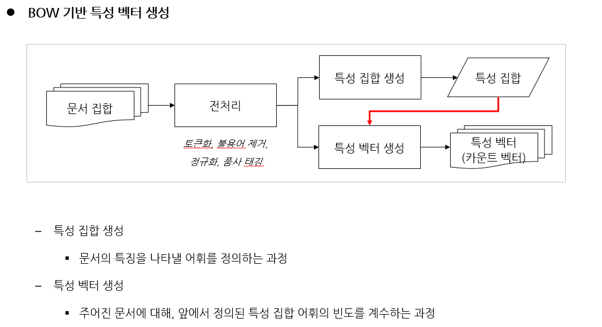


- CountVectorizer의 특성 벡터 생성

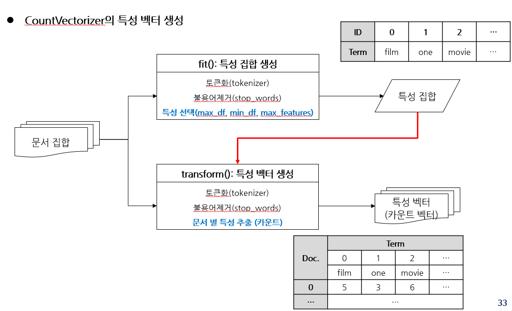

### 3-9. 카운트 벡터의 활용

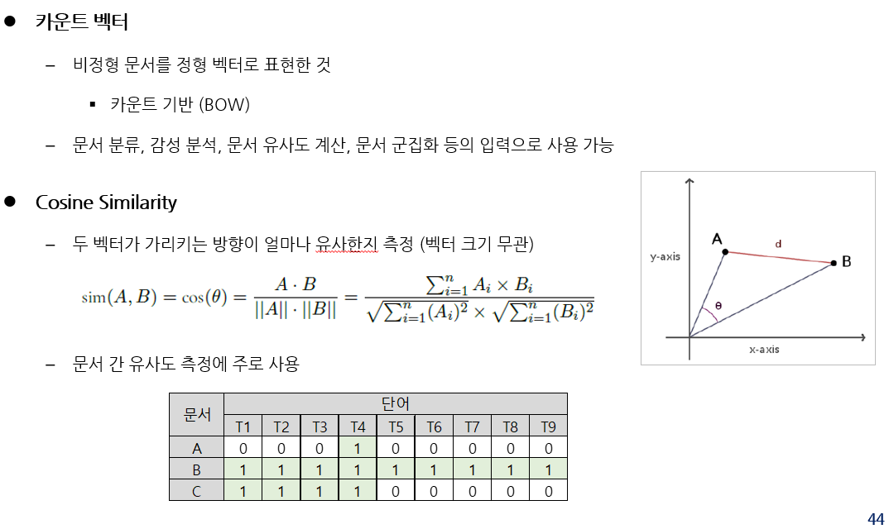

## Week07-1: Document Classfication

```
WEEK HW: 리뷰에 해당하는 영화 제목을 출력하는 코드
```

### 1. Document Classification

- 문서를 미리 정의된 클래스로 구분하는 작업

```
- 뉴스 카테고리 분류, 스팸 메일 분류, 감성 분석 등
- 나이브 베이즈가 널리 사용됨
- 학습용 문서에는 미리 분류된 클래스가 명시되어 있어야 함(Label Tagging)
```

#### 1-1. 문서 분류 데이터 셋

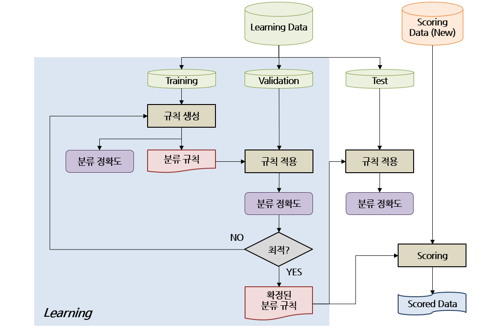

- 기계 학습의 문서 분류 과정


## Naive Bayesian Classifier

- 베이지안 정리 사용: 두 확률 변수의 사전 확률과 사후 확률 사이의 관계를 나타냄

- 주어진 데이터가 속할 확률이 큰 클래스로 해당 데이터를 분류

$ P(X|C_i) = \Pi_{k=1}^{n} P(x_k | C_i) = P(x_1 | C_i) \times P(x_2 | C_i) \times  \dots \times P(x_n | C_i) $

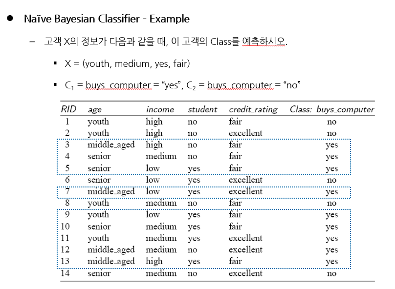

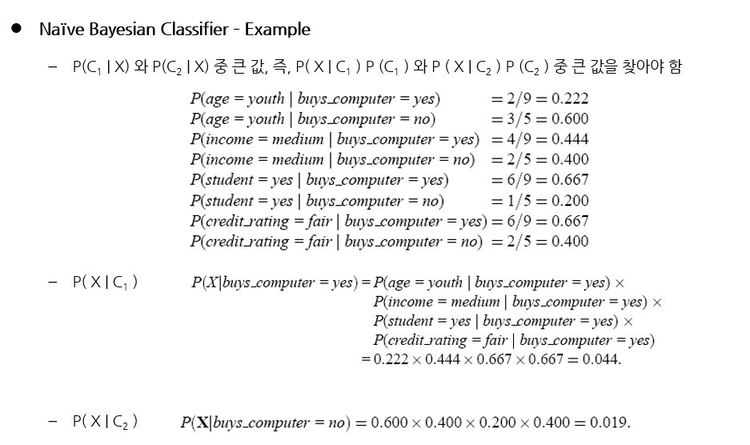

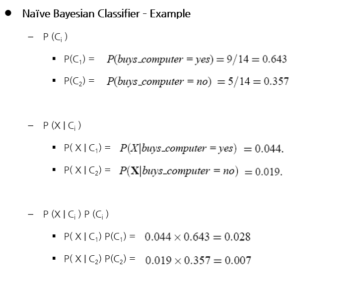


- Laplace Smoothing

```
- 새로운 단어가 출현했을 때 확률이 0이 되는 현상 방지
- 빈도에 특정 값(alpha)를 더함 (주로 1)
```

## Week07-2: Sentiment Analysis

### 1. 감성 분석 접근 법

- 사전 기반 감성 분석

```
- 주요 단어에 대해 감성 값을 부여한 감성 사전 구축
- 문장, 혹은 문서 전체에 대해 감성 값 도출
- 사전 구축 비용이 많이 들고, 부정문 등의 해석이 어려움
```

- 머신러닝 기반 감성 분석

```
- 말뭉치에 대한 학습을 통해 문장, 혹은 문서 전체의 극성 예측
- 클래스가 극성인 분류 문제와 본질적으로 동일(Label이 필요한 Supervised-Learning)
- 특정 도메인의 분류 모델을 그대로 다른 도메인에 적용할 수 없음
```

### 2. Confusion Matrix

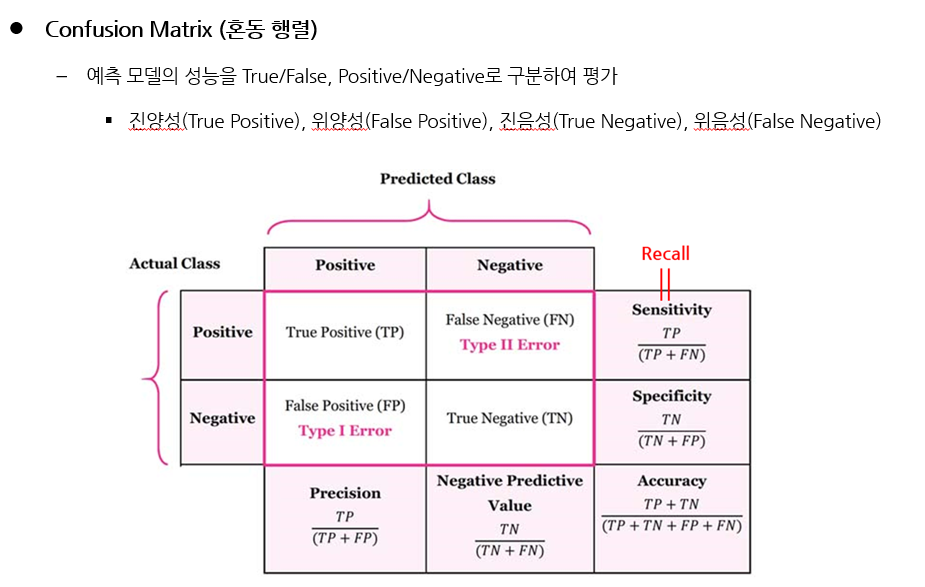

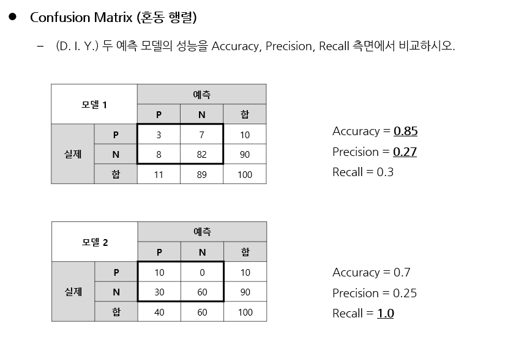

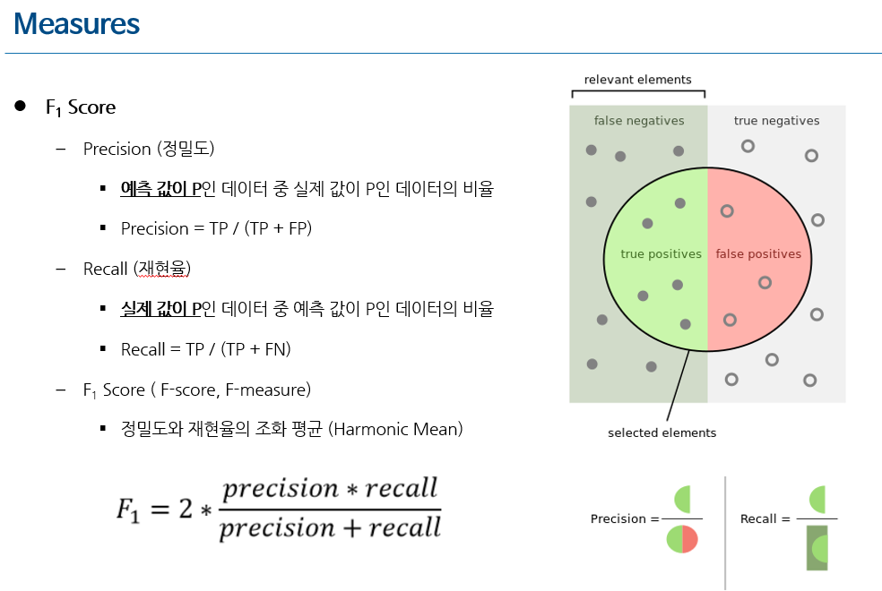

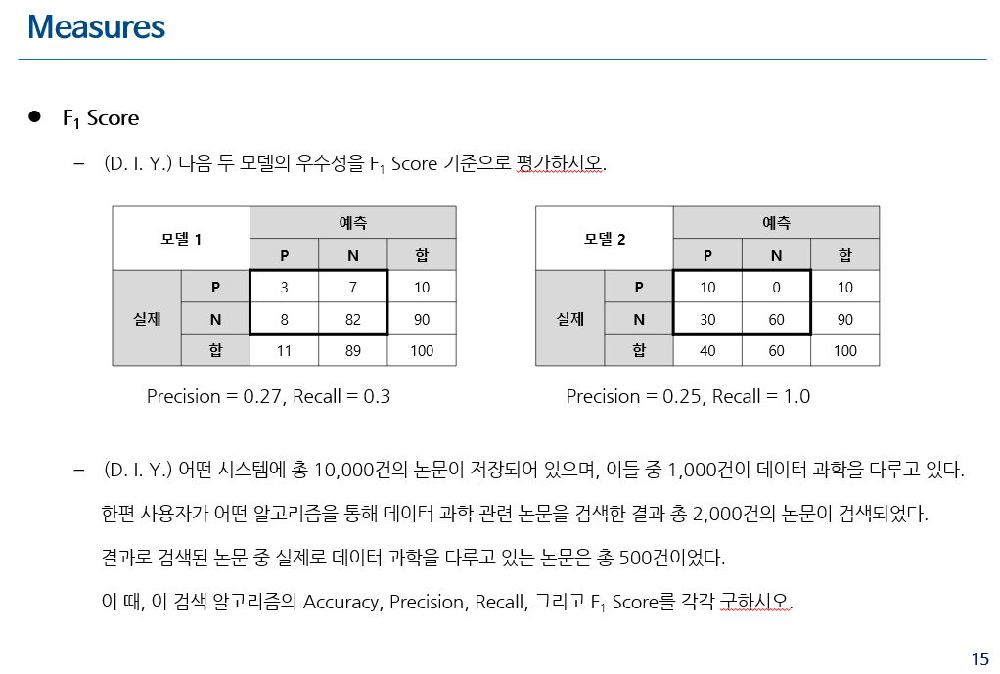