# 텍스트 데이터 분석 내용정리 2편

```
문제 유형
-- Week 01, Week 04, Week 08 제외 전 범위

(개념)
1. Handling Text Files (Week 02)
2. Text Preprocessing  (Week 03)
3. Frequency Analysis (Week 05)
4. Topic Modeling (Week 09)
5. Deep Learning for Text Data (15) (Week 10,11,12,13,14,15)

(코드개념)
1. Document Classfication & Sentiment Analysis (15) (Week 7)

(풀이)
Document Classfication & Sentiment Analysis (Week 06, 07)

Neural Network & Word Embedding (20) (Week 10,11)
-- 손으로 직접 계산하여 푸는 문제
```

Self-Assessment

```
Text Mining, Corpus, Tokenizing, TF-IDF, Transformer

Word Cloud, Sentiment Analysis, Topic Modeling, Word2Vec, BERT
```

## Week09: Topic Modeling

Topic Modeling

```
- 방대한 양의 문서를 구성하고 있는 주요 토픽을 도출함
- 각 토픽은 핵심 단어의 집합으로 구성됨
- 토픽과 문서는 다대다의 관계로 대응됨
- 토픽 모델링 결과로, 각 문서는 토픽 수만큼의 차원을 갖는 벡터로 표현됨
- 넓은 의미의 문서 임베딩에 속함
- LSA 알고리즘과 LDA 알고리즘이 주로 사용됨
1. LSA: 행렬 분해 및 차원 축소 활용
2. LDA: 문서별 토픽 분포, 토픽별 단어 분포에 대한 확률 모형 활용
```

### 1. LDA(Latent Dirichlet Allocation, 잠재 디리클레 할당)

기본 개요
```
- 문서별 토픽 분포, 토픽별 단어 분포에 대한 확률 모형 활용
- 실제로는 각 문서에 출현한 단어 정보만을 토대로 모든 잠재 변수 추론(문서별 토픽 분포, 토픽별 단어 비중을 역추적)
```

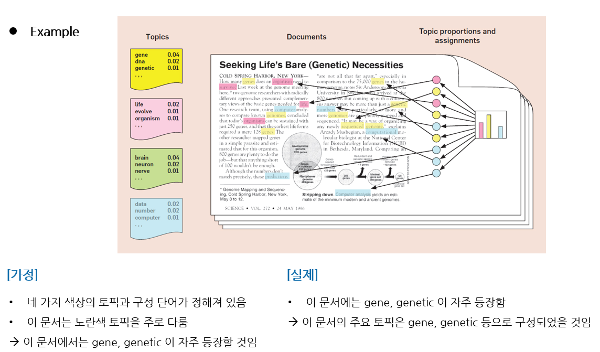

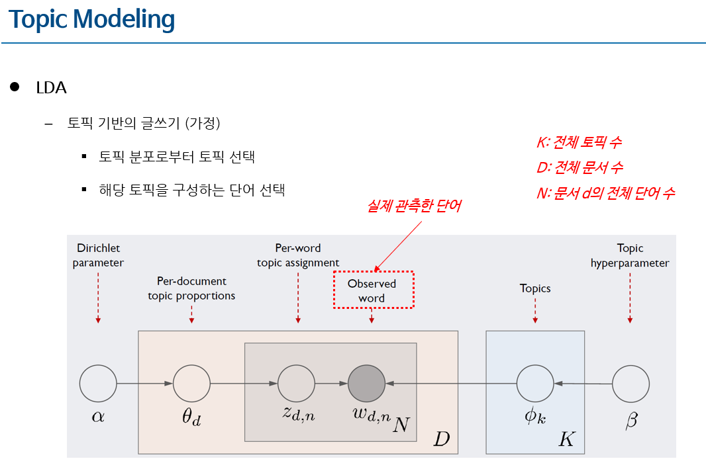


#### 1.1 LDA 모델 요소 (토픽의 말뭉치 비중 벡터)

LDA 모델요소: $ \phi_{k} $

```
k번째 토픽을 구성하는 말뭉치의 비중펙터

예시로, k가 1이면, 첫 번째 열

각 열의 합은 1이 되어야 하며, 단어 비중이 디리클레 분포를 따름
- 하이퍼 파라미터 beta의 영향을 받음
```

#### 1.2 LDA 모델 요소 (문서의 토픽 비중 벡터)

LDA 모델요소: $ \theta_{d} $

```
d번째 문서를 구성하는 토픽의 ㅈ비중 벡터

각 벡터는 토픽 전체 개수 K만큼의 길이를 가짐

예시로, d가 1이면, 첫 번째 행

각 행의 합은 1이 되어야 하며, 토픽 비중이 디리클레 분포를 따름
- 하이퍼 파라미터 alpha의 영향을 받음
```

#### 1.3 LDA 모델 요소 (단어당 토픽 배정)

$Z_{d,n}$: d번째 문서의 n번째 단어에 토픽 할당

- $Z_{3,1}$은 어떤 토픽일 가능성이 큰가?

$W_{d,n}$: d번째 문서의 n번째 단어 확인

- $W_{3,1}$은 어떤 단어일 가능성이 큰가?

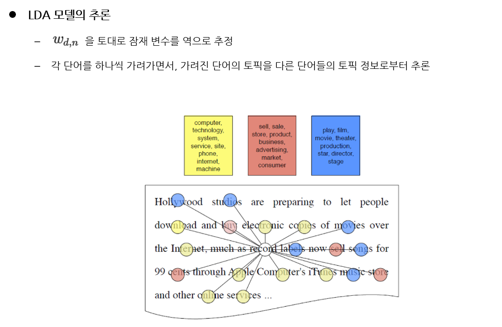

#### 1.4 Topic Evaluation

토픽 모델링이 얼마나 적합하게 수행되었는지를 평가하기 위한 척도

주로, Perplexity (혼란도) 측면과 일관성 (Coherence) 측면에서 연구가 이루어짐

**Perplexity(혼란도)**

- 특정 확률 모델이 실제 관측되는 값을 얼마나 잘 예측하는지 평가

- Perplexity 값이 작을수록 토픽 모델이 문서를 잘 반영하는 것임 (학습이 잘 되었음)

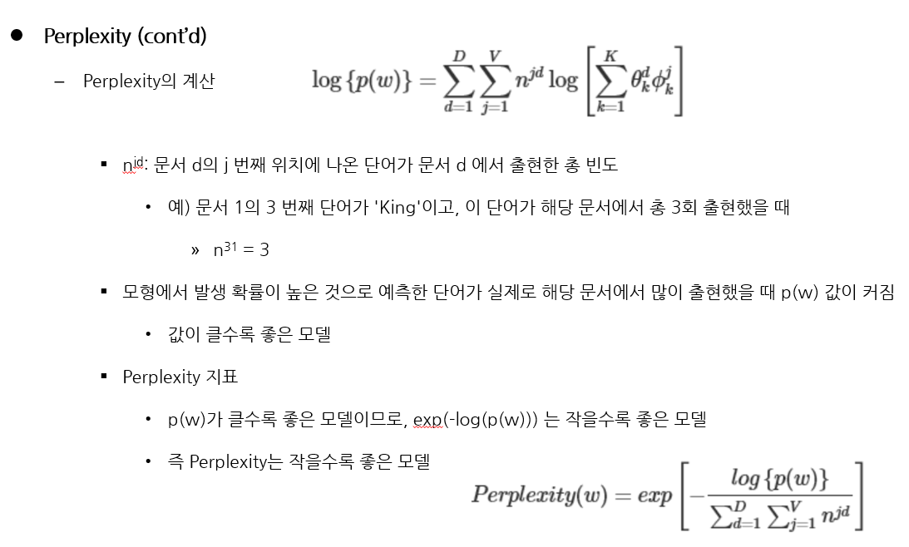

**Topic Coherence(토픽 일관성)**

- 토픽이 얼마나 의미적으로 일관성이 높은지 평가(하나의 토픽 내에 의미적으로 관련성이 높은 단어가 많으면 좋은 토픽)

- 주로 상위 N 개의 단어에 대한 상호 유사도의 평균을 측정하는 방식으로 일관성을 평가함

- Coherence 값이 높을수록 토픽의 일관성이 높음을 의미

- Coherence 측정 주요 방법

```
- 상호 정보량(Pairwise Mutual Information) 활용
1) Wikipedia 말뭉치 활용
2) 토픽의 상위 N 단어를 선정한 뒤, 단어 쌍 조합에 대해 PMI 산출 -> 평균 구함

- 단어 정의 활용(주로 WordNet 활용)
1) 토픽의 상위 N 단어를 선정하여 단어 쌍 조합 생성
2) 단어 쌍 조합에 대해 단어 뜻 풀이에서 겹치는 단어의 수의 평균 산출
```

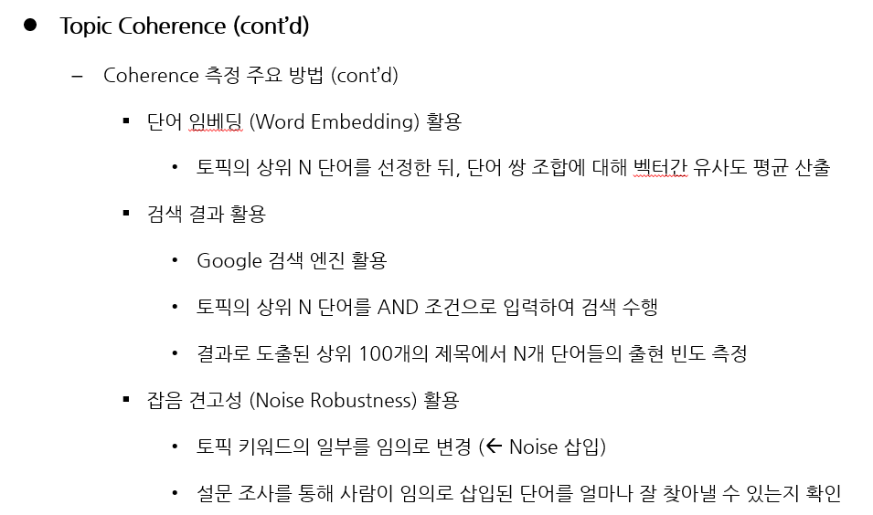

#### 1.5 Dynamic Topic Modeling

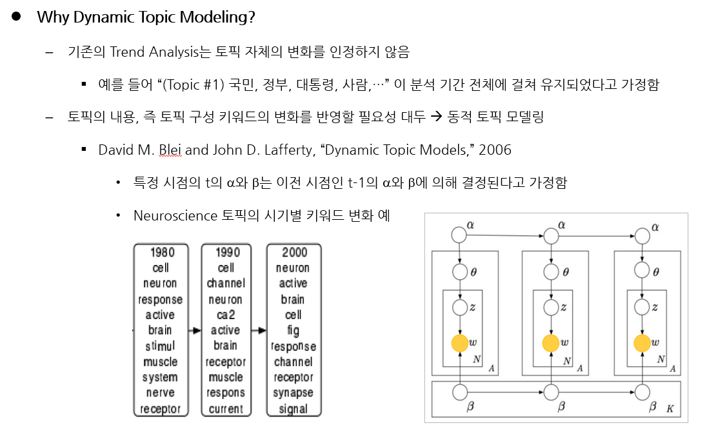

## Week10: Neural Network

### 1. Perceptron

- 다수의 신호를 입력으로 받아서 하나의 신호만 출력
- 입력, 가중치, 출력으로 구성됨(입력:x, 가중치:w, 출력:y로 표기)
- 각 입력에 각 가중치를 곱하고, 이들 값을 총합을 구해서, 이 값이 임계값(theta)을 넘는 경우 1을 출력
- 퍼셉트론으로 동작을 구현하기 위한 가중치(weight)와 편향(bias)는 수동으로 설정함(신경망에서는 자동으로 가중치와 편향의 값을 학습함)

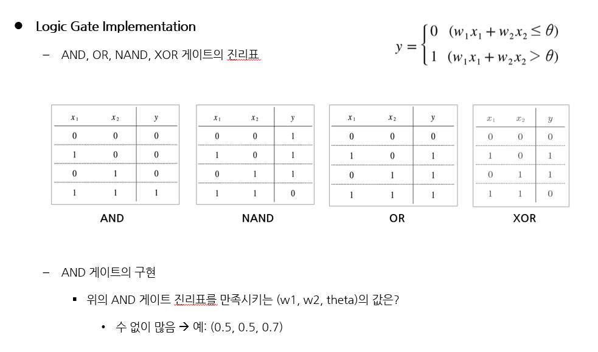

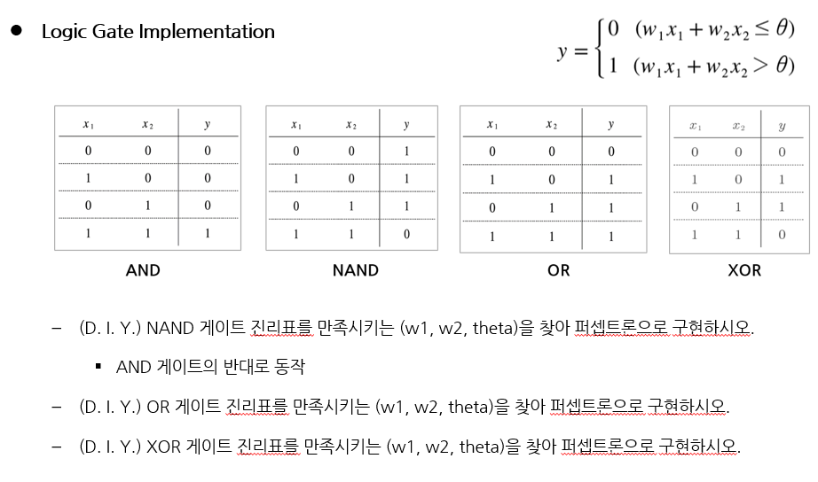

### 2. Neural Network Architecture

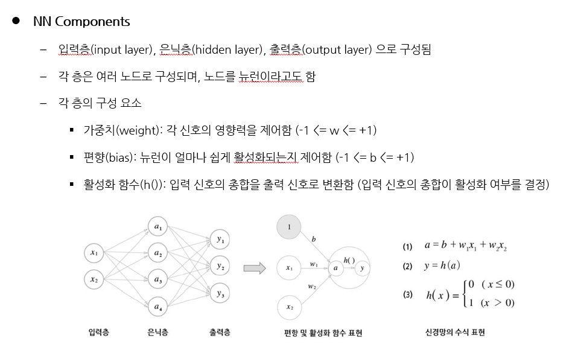

### 3. Backpropagation

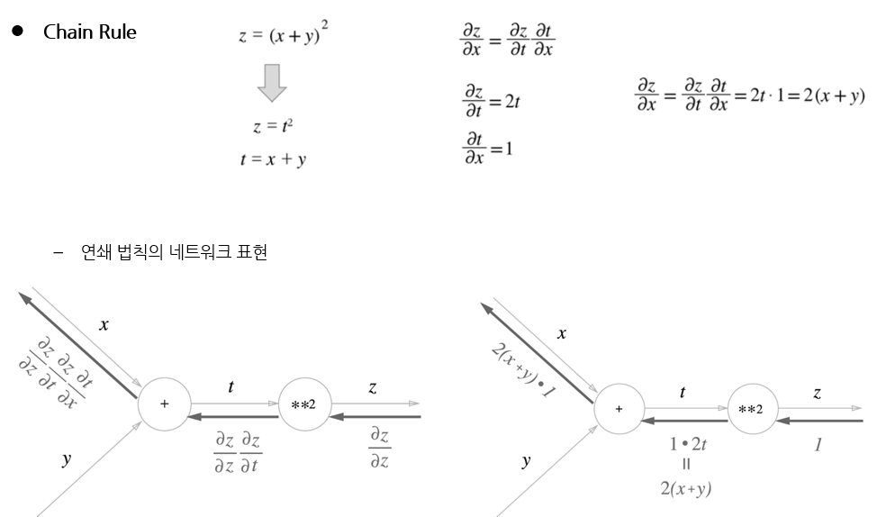

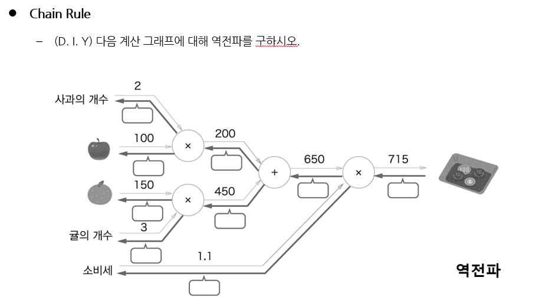

### 3-1. Optimizer

- 목적

```
- 손실 함수의 값을 작게 만드는 매개 변수의 값을 찾음
- 미분 결과에 따라 매개 변수의 값을 변화시키는 다양한 방법(Optimizer) 존재
```

$$ W \leftarrow W - \eta \frac{\partial L}{\partial W} $$

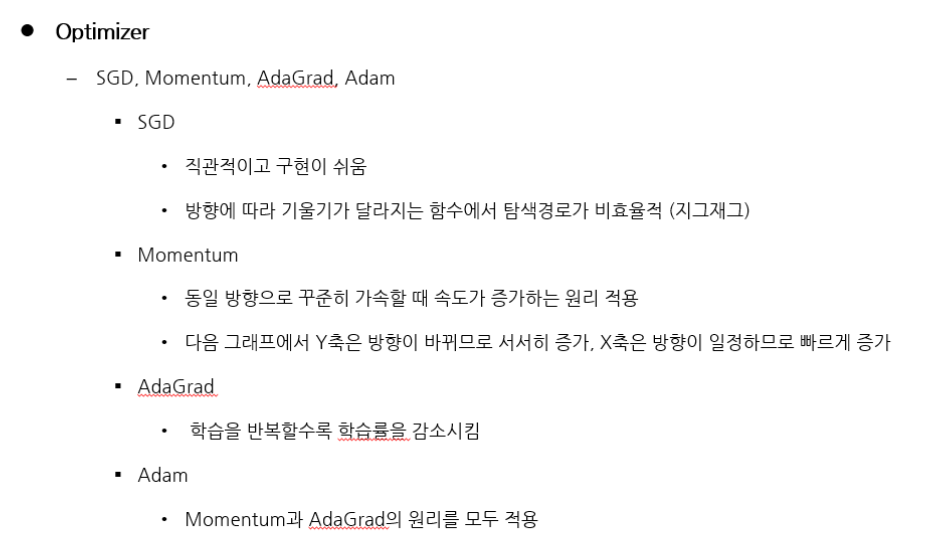

### 4. 신경망을 이용한 문서 분류

- Embedding Layer
```
1. 어떤 형태의 벡터를 입력으로 받아서, 다른 형태의 벡터로 변환함
2. 주로 고차원 one-hot 벡터 -> 저차원 밀집 벡터의 변환 수행
```

- Flatten Layer
```
1. 각 문서는 여러 단어로, 각 단어는 여러 차원으로 구성되어 있음
2. 따라서 각 문서는 2차원 행렬의 형상을 가짐 -> 이를 1차원 벡터로 변환함
ex) 500*64의 행렬을 32,000의 크기를 갖는 1차원 벡터로 변환
```

-  Dense Layer
```
1. 1차원 벡터를 입력으로 받아서 분류 학습을 수행하는 신경망 층
```

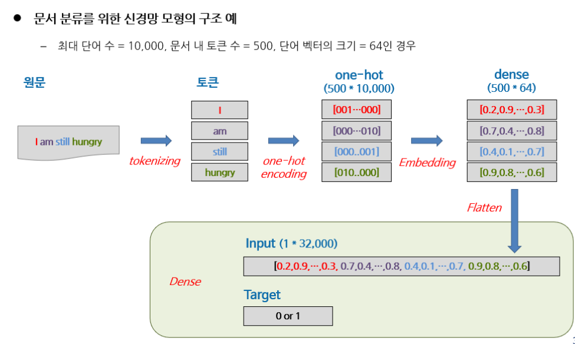

## Week11: Word Embedding

### 1. Word Embedding 개요

- 임베딩이란?

```
객체를 원래의 대수적 성질을 유지하면서, 객체를 특정 차원의 공간에 사상(mapping) 하는 것

- 단어나 문장을 벡터로 변환하여 벡터 공간에 끼워 넣는다는 의미를 포함
```

- 워드 임베딩

```
- 넓은 의미에서는 단어/문서 행렬, 단어/단어 행렬 역시 워드 임베딩에 속함
- 실제로는 고차원(N) 벡터를 저차원(M) 벡터로 압축하여 표현하는 것을 주로 의미함
```

#### 1-1. 추론 기반 단어 표현

- 주변 단어(맥락)로 부터 "?"에 들어갈 단어를 추측
- 신경망이 맥락 정보를 입력받아 각 단어의 출력 확률을 출력
- 반복 학습을 통해 단어의 올바른 분산 표현을 획득

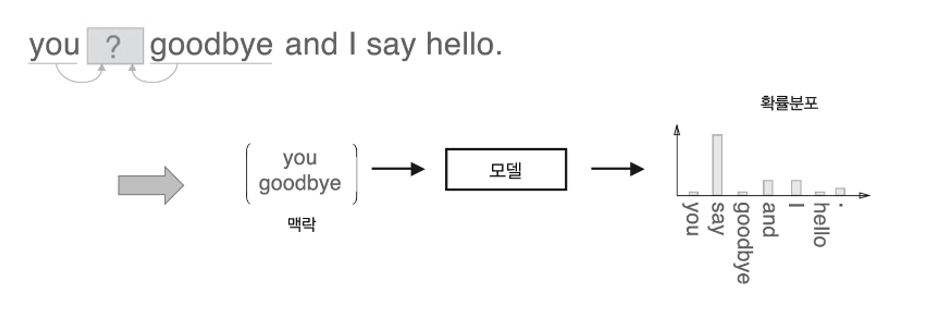

#### 1-2. 통계 기반 vs 추론 기반 기법 비교

- 통계 기반

```
- 단어의 유사성을 인코딩
- 말뭉치 전체에 대해 1회 학습하여 단어의 분산 표현 획득
- 새로운 어휘가 추가된 경우 전체 계산을 다시 수행해야함(동시발생 행렬 재구성, PPMI 재계산, SVD 재계산 등)
```

- 추론 기반

```
- 단어의 유사성뿐 아니라 여러 단어들 간의 복잡한 패턴을 인코딩 (유추 문제 해결에 적합)
- 말뭉치의 일부에 대해 여러 번 반복 학습
- 새로운 어휘가 추가된 경우(지금까지 학습한 가중치를 초기값으로 사용하여 새로운 어휘를 효율적으로 학습)
```

### 2. Word2vec

- 추론 기반 단어 임베딩 알고리즘
- 각 단어의 의미는 해당 단어 주변 단어들의 분포에 의해 파악 가능함
- Word2vec 구현 알고리즘
```
- CBOW(Continuous Bag of Words): 주변 단어로 중심 단어를 예측
- Skip-gram: 중심 단어로 주변 단어를 예측
```
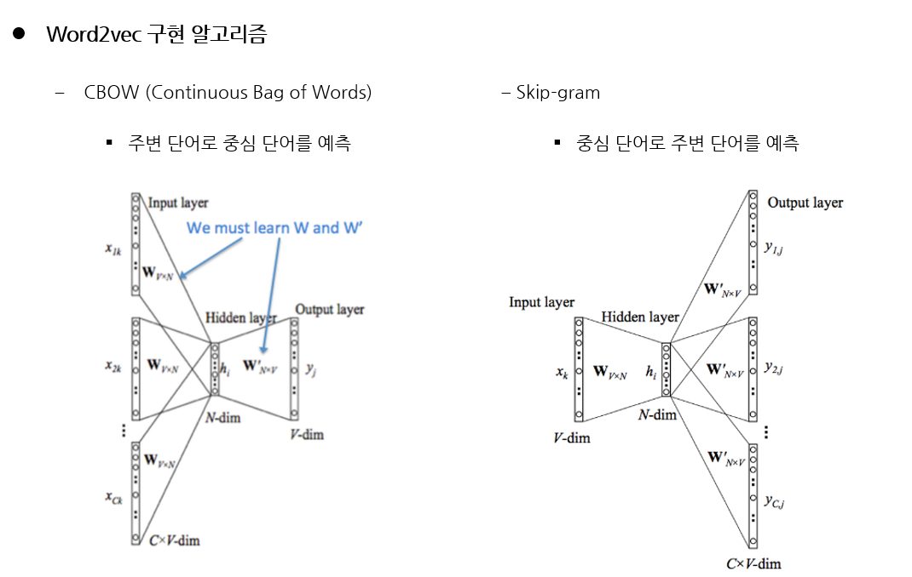

### 3. CBOW(Continuous bag-of-words) 모델

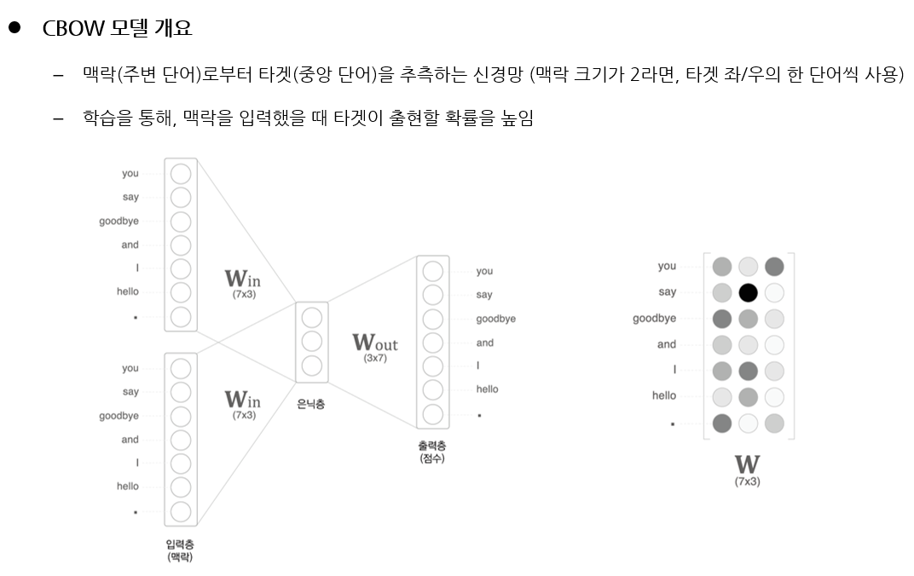

### 4. skip-gram 모델

- word2vec은 CBOW 모델과 함께 skip-gram 모델을 제안
- skip-gram은 CBOW의 맥락과 타깃을 서로 바꾼 모델
- CBOW에 비해 어려운 문제에 도전하는 것(단 하나의 단어로 다른 여러 단어들을 예측)
- 일반적으로 정밀도는 skip-gram이 높으며, 속도는 CBOW가 빠름

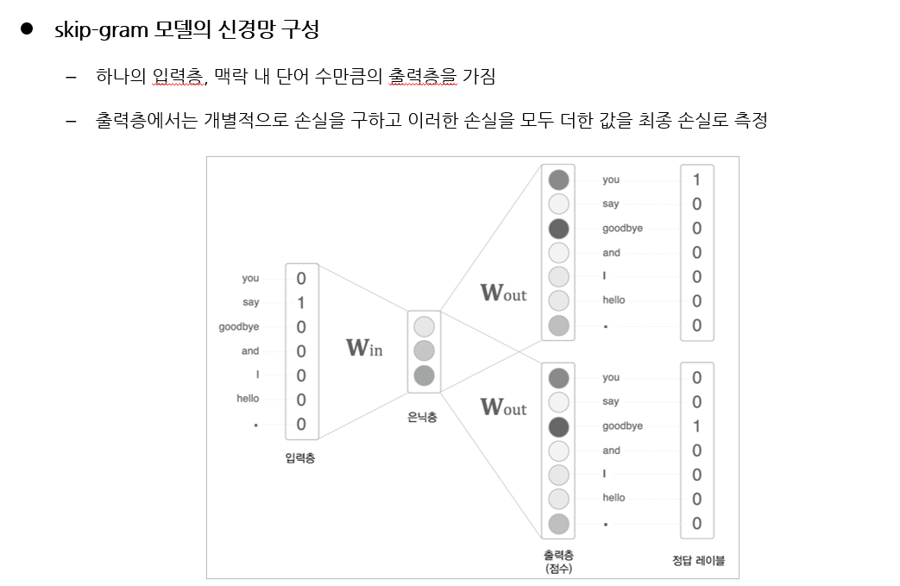

### 5. Doc2Vec


