# 텍스트 데이터 분석 내용정리 3편

```
문제 유형
-- Week 01, Week 04, Week 08 제외 전 범위

(개념)
1. Handling Text Files (Week 02)
2. Text Preprocessing  (Week 03)
3. Frequency Analysis (Week 05)
4. Topic Modeling (Week 09)
5. Deep Learning for Text Data (15) (Week 10,11,12,13,14,15)

(코드개념)
1. Document Classfication & Sentiment Analysis (15) (Week 7)

(풀이)
Document Classfication & Sentiment Analysis (Week 06, 07)

Neural Network & Word Embedding (20) (Week 10,11)
-- 손으로 직접 계산하여 푸는 문제
```

Self-Assessment

```
Text Mining, Corpus, Tokenizing, TF-IDF, Transformer

Word Cloud, Sentiment Analysis, Topic Modeling, Word2Vec, BERT
```

## Week12: RNN & LSTM

### 1. Language Model

- 주어진 텍스트나 문장을 이해하고 생성하는 알고리즘

- 특정 단어의 시퀀스(=문장)가 출현할 가능성을 확률로 측정

#### 1-1. word2vec as Language Model

- word2vec은 단어의 분산표현을 위해 고안됨 개념(-> 단어를 고정 크기 벡터로 표현)

- CBOW는 앞뒤 단어로 가운데 단어를 예측, 조건부 확률 활용

$$ P(w_{t} | w_{t-1}, w_{t+1})  $$

- 현재 시점 이전의 두 시점을 맥락으로 사용시

$$ P(w_{t} | w_{t-2}, w_{t-1})  $$

- 특정 단어의 이전에 출현한 모든 단어를 맥락으로 사용하는 예

$$ P(w_{t} | w_1, w_2, ... , w_{t-1})  $$

➡️ 특정 단어의 시퀀스가 출현할 전체 확률

$$ \Pi_{t=1}^{m} P(w_t | w_1, ... , w_{t-1}) $$

```
word2vec으로 맥락을 보고 다음 칸에 들어올 단어를 예측한다면??

1. 맥락의 길이가 매우 길어야 함

2. 맥락의 단어 순서가 무시됨

- "TV in his room is large"와 "his room in TV is large"가 동일하게 취급됨
```

➡️ 다른 형태 Language Model이 필요함

### 2. RNN(Recurrent Neural Network)

- 순환 신경망: 순환하는 경로가 존재하는 신경망

#### 2-1. RNNLN

- RNN 언어 모델에서 성능 척도로 혼란도(Perplexity) 사용

```
혼란도

- Target의 예측 확률을 구한 뒤, 이의 역수를 취하여 직관적으로 계산 가능
```

### LSTM(Long Short-Term Memory)

#### 1. 언어 모델로서의 RNN의 한계

- RNN이 과거 방향으로 의미있는 기울기를 전달해야 함

- BUT, 장기 의존 관계의 학습이 어려움(기울기 소실의 문제, 기울기 폭발의 문제)

#### 2. RNN 오차역전파에서의 기울기 계산

- 'tanh'의 미분 그래프는 항상 0~1을 가짐

- 여러 번 곱할 수록(=경사가 길어질수록) 항상 감소 -> 기울기 소실

- 'MatMul'의 미분: 오차 역전파에서 'MatMul'은 동일한 행렬 $W_h$가 반복적으로 곱해져서 1보다 작으면 지수적으로 감소하고, 1보다 크면 폭발적으로 증가

#### 3. LSTM 등장

1. 기울기 폭발의 해결

- Gradinets Clipping 도입 (1보다 작은 수를 곱하여 기울기를 줄임)

2. 기울기 소실의 해결

- RNN 구조를 근본적으로 변경

```
- 결국 tanh와 MatMul을 거치지 않는 경로를 추가하는 것이 관건
- 몇 가지 게이트(Gate)를 추가 -> 단기 기억 / 장기 기억
```

- 게이트: 흘려 보낼 정보량을 조절(게이트를 얼마나 열지도 자동으로 학습)

3. Memory Cell

- LSTM의 기억 전용 메커니즘

#### 4. LSTM의 내부 구조

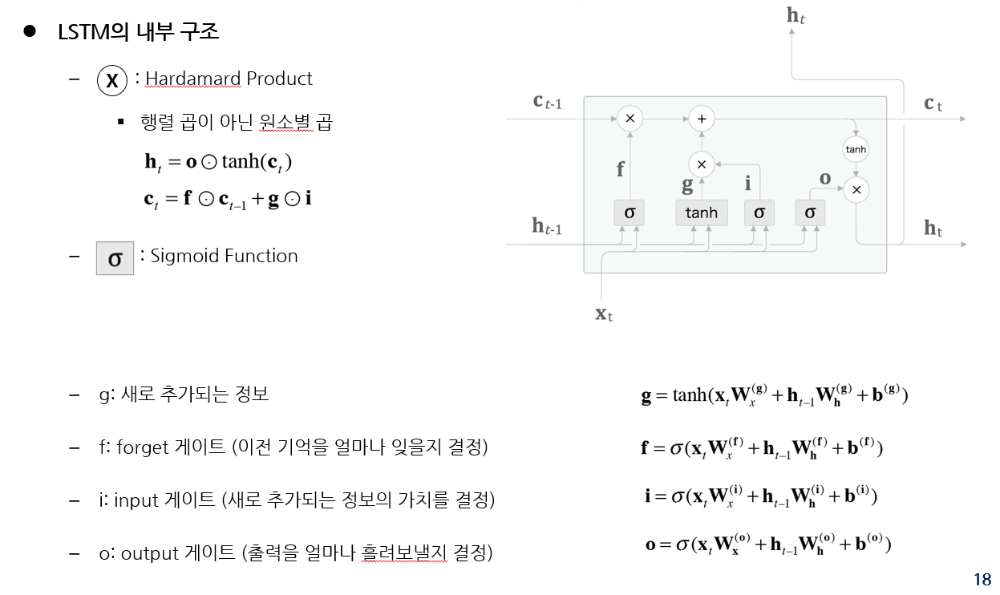

#### 5. Memory Cell의 오차 역전파

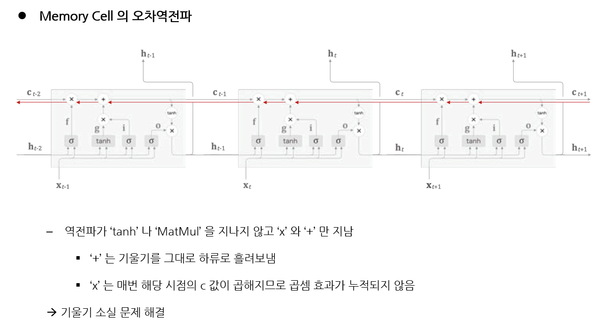

## Week13: Seq&Seq & Attention

### 1. seq2seq

- 시계열 데이터를 다른 시계열로 변환
- Encoder와 Decoder 모듈로 구성된다.
```
Encoder와 Decoder 각각에 LSTM (RNN 계열) 사용
```
- 기계 번역, 자동 요약, 질의 응답 등에 사용

#### 1-1. Encoder의 동작(학습)

- 임의의 길이의 문장을 입력으로 받음

➡ 고정 길이의 벡터 h로 변환

-  h는 입력 문장의 정보를 축약하고 있음

➡ Decoder에서 문장의 첫 단어 생성에 활용됨

#### 1-2. Decoder의 동작(학습)

- 첫 단어 예측을 위해 Encoder의 h를 활용

#### 1-3. sqe2seq 문제점

- Encoder는 입력 문장을 길이에 무관하게 고정 길이의 벡터 h로 압축

- 정보 손실이 필연적
- 벡터 하나만 보내는 것이 문제

#### 1-4. 개선 방안

- Encoder는 최종 단계의 상태 벡터 뿐 아니라, 각 단계의 상태 벡터를 모두 묶어서 행렬(hs)로 전달

- Decoder는 각 단계에서 hs 중 특정 부분에 더욱 집중하여 추론 수행

➡ Attention Mechanism

### 2. Attention Mechanism

#### 1-1. Encoder의 동작

- 단어 수만큼의 벡터를 포함하는 hs 행렬 출력
- 각 벡터는 해당 단어에 대한 정보 포함

```
각각의 벡터는 이전 벡터 + 현재 벡터의 벡터이다.
```

#### 1-2. Decoder의 동작

- Encoder에서 받은 hs의 마지막 행을 최초 상태 벡터로 사용 (기존의 h와 동일)
- Attention 계층: 각 단어를 예측할 때, hs의 어떤 행에 더욱 집중할 것인가?

#### 1-3. Attention 계층의 동작

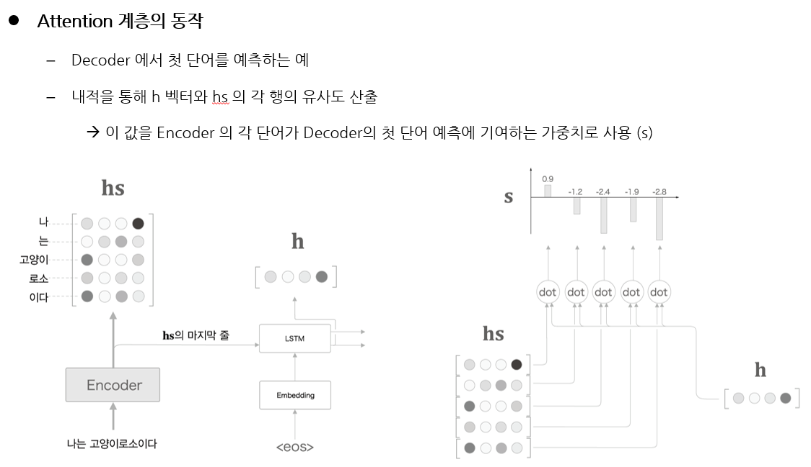

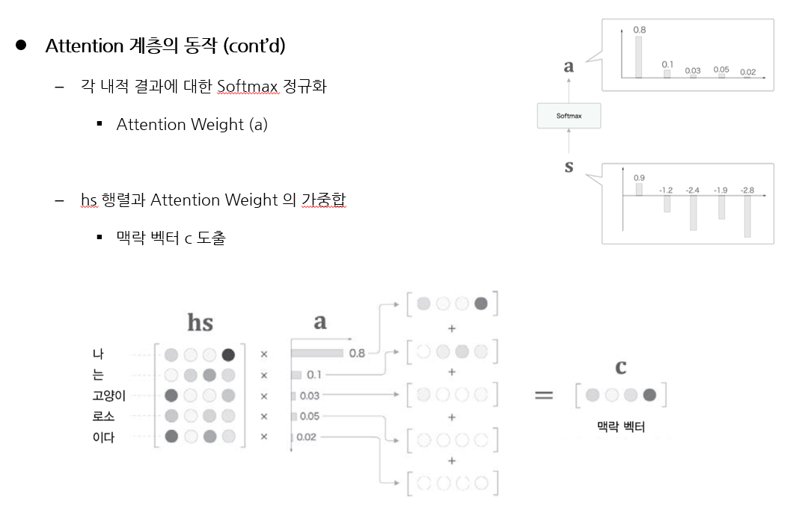

## Week14: Transformer

### 1. seq2seq (with attention)의 한계

- RNN의 구조적 특성으로 인한 비효율적 학습

```
- RNN은 이전 시점의 계산 결과를 이용하여 순차적으로 학습 -> 병렬계산 불가 -> 비효율

- RNN을 사용하지 않고 sequnce를 sequence로 변환하는 연구가 활발하게 이루어지고 있음
- 가장 대표적인 모델: Transformer
```

### 2. Transformer

- Attention is all you need: RNN을 사용하지 않고 Attention만으로 시계열 변환 모델 구현

- Self-attention Mechanism 제안: 하나의 시계열 데이터를 대상으로 한 Attention

### 3. Transformer의 구조


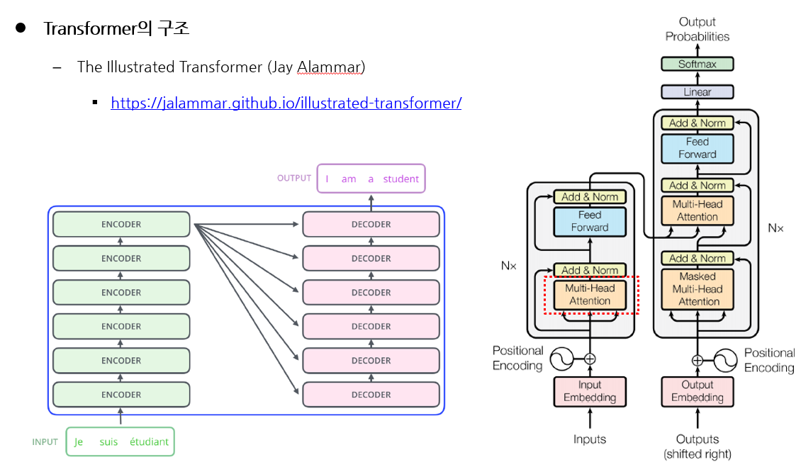

```
Multi-Head Attention
: 확실한 단어가 하나 있으면 앞뒤로 여러 개의 단어를 참고하는 과정 (보통 8개 혹은 12개 등등 정해 놓고 쓰지만 이 과정에서 여러 경우를 고려하여 Attention하겠다.)

Positional Encoding: 위치에 따른 단어의 차별성을 부여하기 위해 키를 부여하는 것

Add & Norm: 넘어가는 과정에서 이전 과정에 대해 Add &Norm을 하여 변화를 주는 과정

Feed Forward: 순전파 알고리즘
```

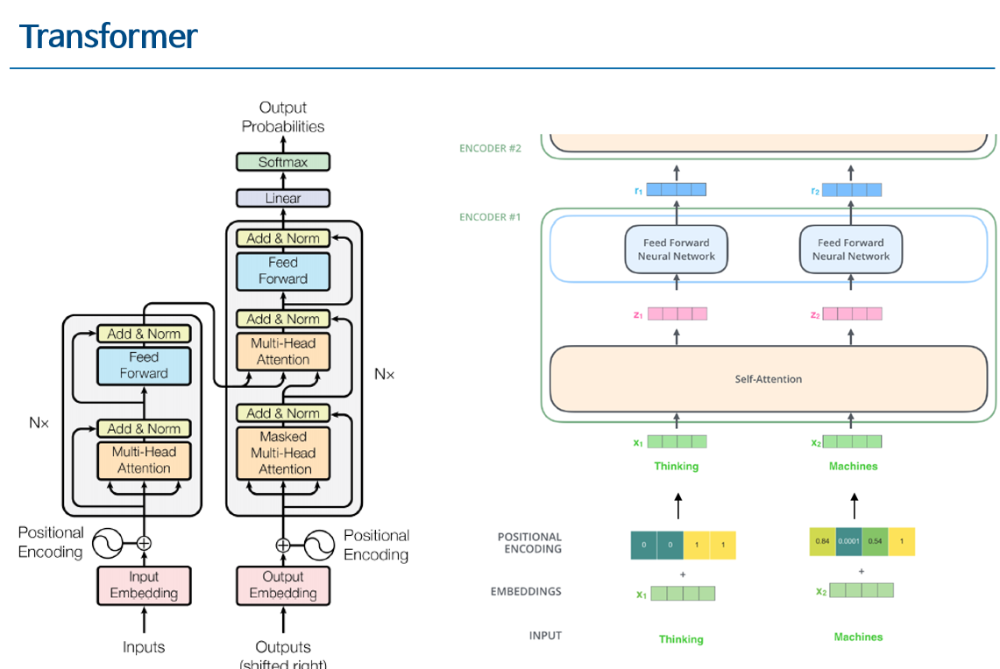

```
Multi Head Attention을 자세히 보려면, Self-Attention을 알아야 한다.

가령 “Thinking Machines”라는 단어가 들어온다면, 임베딩을 하여 단어를 숫자로 바꾼 뒤,

POSITIONAL ENCODING을 통해 단어에 순서 키를 부여한다.

만약, 첫 번째 단어가 Thinking이고, 세 번째 단어가 Thinking이라고 하면, POSITIONAL ENCODING을 통해 첫 번째 단어와 세 번째 단어가 다름을 알 수 있는 것이다.
```

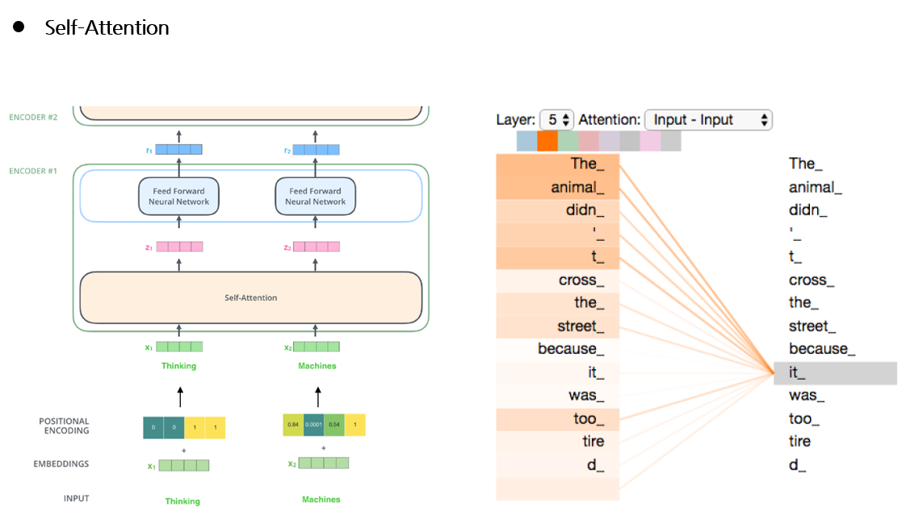

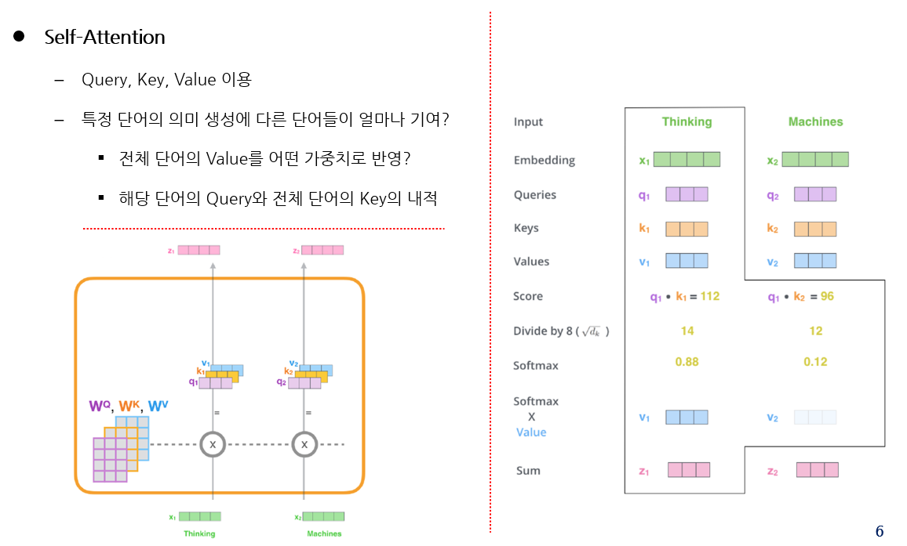

```
Q: 임베딩된 단어의 대상(지금 순서에서의 단어) -> 벡터

K: Q에 영향을 주는 단어 -> 벡터

V: Q,K를 가지고 Attention 가중치를 준다했을 때, 가중치의 값

Score는 Q와 K의 내적으로 이루어짐
```

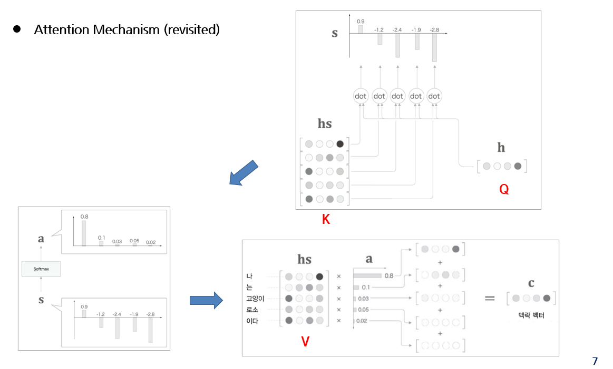

### 4. Self-Attention과 일반 Attention의 비교

**1. Query 벡터는 입력 시퀀스의 특정 토큰에 대한 정보 포함**
- 다른 위치 토큰의 Key 벡터와 유사도 계산에 사용됨
- Attention의 상태 벡터(h) 역할 수행

**2. Key 벡터는 입력 시퀀스의 문맥을 파악하고 주요 특징을 추출하는 역할 수행**
- 어텐션 가중치 계산에 사용됨  Query 벡터와의 유사도 계산
- Attention의 hs 행렬의 각 행의 역할 수행
- Query와 Key의 내적은 Attention의 어텐션 가중치의 역할 수행

**3. Value 벡터는 입력 시퀀스의 각 원소에 대한 실제 정보 포함**
- 출력 시퀀스의 생성에 사용됨
- Attention에서는 Key와 Value가 동일함 (hs의 각 행)
- Self-Attention에서는 Key와 Value를 분리함 (위치 정보와 내용 정보의 분리)

## Week15: BERT

### 1. Transfer Learning(전이 학습)

- 미리 학습된 모델을 다른 작업(Task)에 이용하는 것

```
- Pre-training(사전 학습): 최초의 모델을 만들기 위한 학습
- Fine-tuning(미세 조정): 사전 학습 모델을 새로운 문제에 적용하기 위해 일부 가중치를 조정하는 학습
```

- 트랜스포머의 구조

1. Encoder: 입력 문장으로부터 Features를 추출
2. Decoder: Features를 사용하여 출력 문장을 생성

➡ 사전 학습 언어모델을 만든다면, 트랜스포머의 어떤 부분이 필요할까?

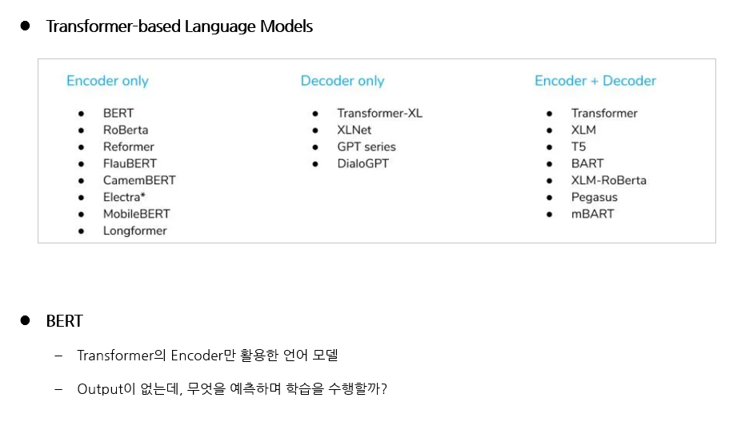

### 2. BERT

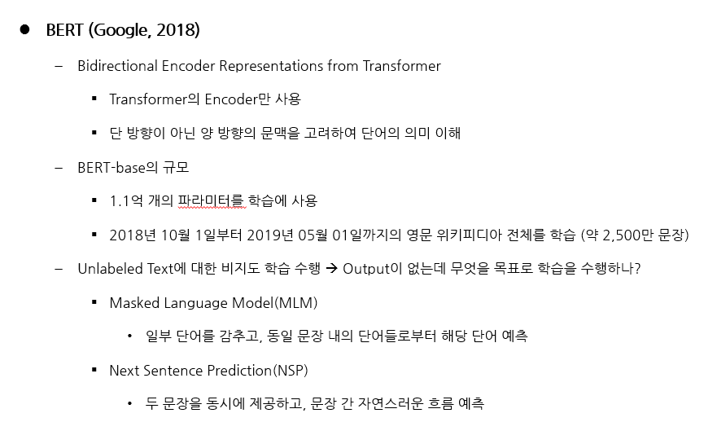

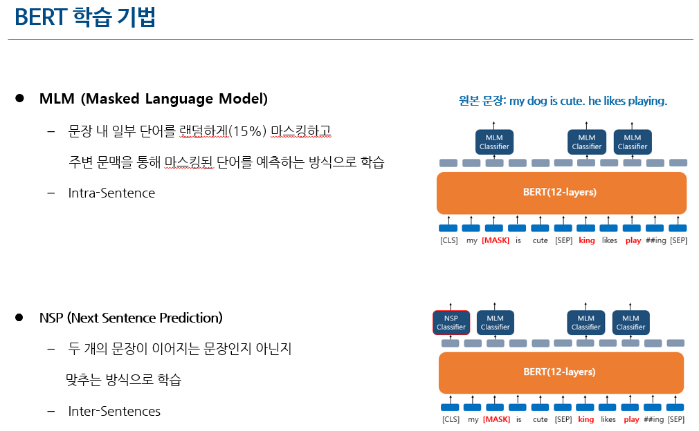

### 3. Fine-tuning

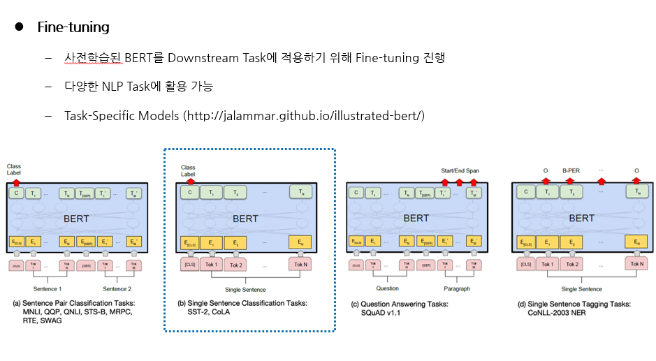

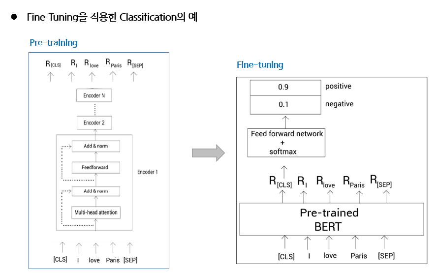