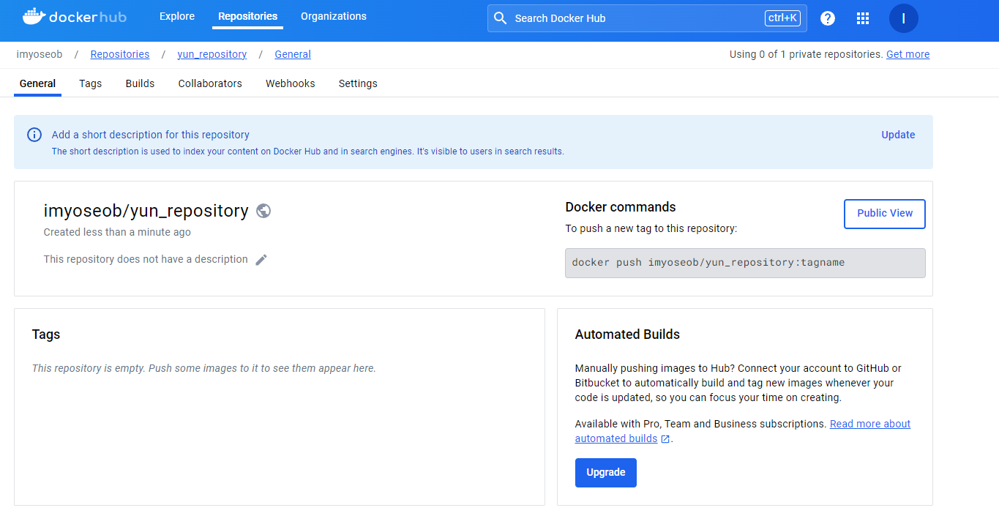
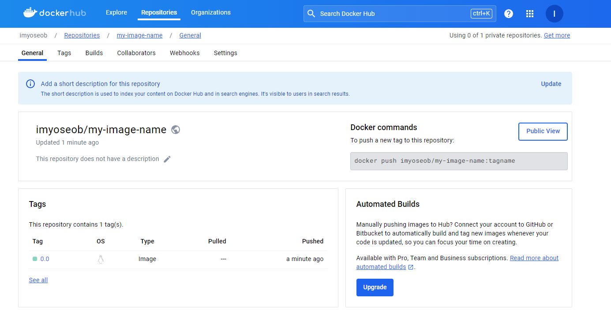

# Docker 실습

## Container 실습

**✔️ 도커 버전 확인**

```bash
yun@test01:/var/run$ docker -v
Docker version 25.0.4, build 1a576c5
```

**✔️ 컨테이너 생성해보기**

- docker run :  컨테이너를 생성하고 실행하는 역할

```bash
yun@test01:~$ docker run -i -t ubuntu:14.04
Unable to find image 'ubuntu:14.04' locally
14.04: Pulling from library/ubuntu
2e6e20c8e2e6: Pull complete
0551a797c01d: Pull complete
512123a864da: Pull complete
Digest: sha256:******
Status: Downloaded newer image for ubuntu:14.04
root@163e37e1f7b8:/#
```
ubuntu:14.04: 컨테이너를 생성하기 위한 이미지

-i -t : 컨테이너와 상호(interactive) 입출력을 가능하게 함

**✔️ 컨테이너에서 빠져나오기**

1. exit 혹은 Ctrl + D: 컨테이너 내부에서 빠져나오면서 동시에 컨테이너 정지

2. Ctrl + P 혹은 Ctrl + Q: 컨테이너의 셸에서만 빠져나옴


**✔️ 이미지 받아오기**

```bash
yun@test01:~$ docker pull centos:7
7: Pulling from library/centos
2d473b07cdd5: Pull complete
Digest: sha256:******
Status: Downloaded newer image for centos:7
docker.io/library/centos:7
yun@test01:~$
yun@test01:~$
yun@test01:~$ docker images
REPOSITORY   TAG       IMAGE ID       CREATED       SIZE
centos       7         eeb6ee3f44bd   2 years ago   204MB
ubuntu       14.04     13b66b487594   2 years ago   197MB
```

docker pull : 이미지를 내려받을 때 사용

docker images : 도커 엔진에 존재하는 이미지의 목록을 출력

**✔️ create 명령어로 컨테이너 생성하기**

```bash
yun@test01:~$ docker create -i -t --name mycentos centos:7
e165ec6d2eec....
```
e165ec6d2eec.... :  컨테이너의 고유 ID로 앞의 12자리만 사용 (docker inspect 명령어로 컨테이너 ID를 다시 확인 할 수 있음)

```bash
yun@test01:~$ docker start mycentos
mycentos
yun@test01:~$ docker attach mycentos
[root@e165ec6d2eec /]#
```

docker start : 컨테이너 시작

docker attach : 컨테이너 내부로 들어가는 명령어

**run 명령어, create 명령어 차이**

run 명령어는 pull, create, start 명령어를 일괄적으로 실행 후, attach가 가능한 컨테이너라면 컨테이너 내부로 들어감.

create 명령어는 도커 이미지를 pull한 뒤, 컨테이너 생성만 함. start, attach를 실행하지 않음

**✔️ Ctrl + P, Q를 입력해 컨테이너에서 나온 뒤, 목록 확인**

```bash
[root@e165ec6d2eec /]# read escape sequence
yun@test01:~$ 
yun@test01:~$ docker ps
CONTAINER ID   IMAGE      COMMAND       CREATED         STATUS         PORTS     NAMES
e165ec6d2eec   centos:7   "/bin/bash"   5 minutes ago   Up 3 minutes             mycentos
yun@test01:~$
yun@test01:~$ docker ps -a
CONTAINER ID   IMAGE          COMMAND       CREATED          STATUS                     PORTS     NAMES
e165ec6d2eec   centos:7       "/bin/bash"   5 minutes ago    Up 3 minutes                         mycentos
163e37e1f7b8   ubuntu:14.04   "/bin/bash"   11 minutes ago   Exited (0) 9 minutes ago             boring_dijkstra
```

docker ps : 정지되지 않은 컨테이너만 출력

docker ps -a : 정지된 컨테이너를 포함한 모든 컨테이너 출력

**✔️ 컨테이너 삭제**

```bash
yun@test01:~$ docker ps -a
CONTAINER ID   IMAGE          COMMAND               CREATED          STATUS                      PORTS     NAMES
51d1486f399a   ubuntu:14.04   "echo hello world!"   25 seconds ago   Exited (0) 24 seconds ago             eager_lederberg
e165ec6d2eec   centos:7       "/bin/bash"           8 minutes ago    Up 6 minutes                          mycentos
163e37e1f7b8   ubuntu:14.04   "/bin/bash"           14 minutes ago   Exited (0) 12 minutes ago             boring_dijkstra
yun@test01:~$
yun@test01:~$ docker rm eager_lederberg
eager_lederberg
yun@test01:~$
yun@test01:~$ docker ps -a
CONTAINER ID   IMAGE          COMMAND       CREATED          STATUS                      PORTS     NAMES
e165ec6d2eec   centos:7       "/bin/bash"   8 minutes ago    Up 7 minutes                          mycentos
163e37e1f7b8   ubuntu:14.04   "/bin/bash"   14 minutes ago   Exited (0) 12 minutes ago             boring_dijkstra
yun@test01:~$
yun@test01:~$ docker stop mycentos
mycentos
yun@test01:~$
yun@test01:~$ docker rm mycentos
mycentos
yun@test01:~$
yun@test01:~$ docker ps -a
CONTAINER ID   IMAGE          COMMAND       CREATED          STATUS                      PORTS     NAMES
163e37e1f7b8   ubuntu:14.04   "/bin/bash"   16 minutes ago   Exited (0) 14 minutes ago             boring_dijkstra
```

## Docker Image 실습

**✔️이미지로 만들 컨테이너 생성하기**

```bash
docker run -i -t --name commit_test ubuntu:14.04
echo test_first! >> first
```

컨테이너 생성 후, 파일 확인
```bash
root@test01:~# docker ps
CONTAINER ID   IMAGE          COMMAND       CREATED         STATUS              PORTS     NAMES
436d02a8846e   ubuntu:14.04   "/bin/bash"   3 minutes ago   Up About a minute             commit_test
root@test01:~#
root@test01:~#
root@test01:~# docker attach commit_test
root@436d02a8846e:/#
root@436d02a8846e:/# ls
bin  boot  dev  etc  first  home  lib  lib64  media  mnt  opt  proc  root  run  sbin  srv  sys  tmp  usr  var
root@436d02a8846e:/# cat first
test_first!
root@436d02a8846e:/#
```

**✔️ docker commit 명령어를 입력해 컨테이너를 이미지로 만들기**

docker commit 명령어 형식
```bash
docker commit [OPTIONS] CONTAINER [REPOSITORY:[:TAG]]
```

commit_test라는 컨테이너를 commit_test:first라는 이름의 이미지로 생성

```bash
root@test01:~# docker commit \
> -a "yun" -m "my first commit" \
> commit_test \
> commit_test:first
sha256:dbe8cd91daf0d181a...
# -a: author를 뜻하며, 이미지의 작성자를 나타내는 메타데이터를 이미지에 포함시킴
# 이미지의 작성자 데이터는 "yun"으로 설정
# commit_test: 이미지의 이름
# first: 태그 이름
```

**✔️ docker image 명령어로 이미지가 생성되었는지 확인**

```bash
root@test01:~# docker images
REPOSITORY    TAG       IMAGE ID       CREATED         SIZE
commit_test   first     dbe8cd91daf0   2 minutes ago   197MB
centos        7         eeb6ee3f44bd   2 years ago     204MB
ubuntu        14.04     13b66b487594   2 years ago     197MB
```

**✔️ 이미지 삭제하기**

```bash
root@test01:~# docker rmi commit_test:first
Untagged: commit_test:first
Deleted: sha256:dbe8cd91daf0d181a98d582efa4f0d3e9452c140edd4a2b0fdb4db4f2cae1819
Deleted: sha256:adeab675ba3c6ef505c38e27d56b55e9cfcade220993fa2b26895b8191962103
root@test01:~#
root@test01:~# docker images
REPOSITORY   TAG       IMAGE ID       CREATED       SIZE
centos       7         eeb6ee3f44bd   2 years ago   204MB
ubuntu       14.04     13b66b487594   2 years ago   197MB
```

**✔️ 이미지 추출**

docker save 명령어를 사용하여 컨테이너의 커맨드, 이미지 이름과 태그 등 이미지의 모든 메타 데이터를 포함해 하나의 파일로 추출. 

```bash
root@test01:~# docker save -o ubuntu_14_04.tar ubuntu:14.04
# -o 옵션에는 추출될 파일명을 입력
```

추출된 이미지는 load 명령어로 도커에 다시 로드할 수 있음

```bash
root@test01:~# docker save -o ubuntu_14_04.tar ubuntu:14.04
root@test01:~#
root@test01:~# docker load -i ubuntu_14_04.tar
Loaded image: ubuntu:14.04
# 이전의 이미지와 완전히 동일한 이미지(ubuntu:14.04)가 도커 엔진에 생성
```

docker commit 명령어로 컨테이너를 만들면 컨테이너에서 변경된 사항 뿐만 아니라 컨테이너가 생성될 때 설정된 detached 모드, 컨테이너 커맨드와 같은 컨테이너의 설정 등도 이미지와 함게 저장

export 명령어는 컨테이너의 파일시스템을 tar 파일로 추출하여 컨테이너 및 이미지에 대한 설정 정보를 저장하지 않음

**import, export 설명**
```bash
docker export -o rootFS.tar mycontainer
docker import rootFS.tar mycontainer:first
# mycontainer 라는 컨테이너의 파일시스템을 rootFS.tar 파일로 추출하고
# 이 파일을 import 명령어로 mycontainer:first이라는 이미지로 다시 저장
```

**import, export 실습**
```bash
root@test01:~# docker ps -a
CONTAINER ID   IMAGE          COMMAND       CREATED          STATUS                  PORTS     NAMES
5a0e4991f894   ubuntu:14.04   "/bin/bash"   44 seconds ago   Up 43 seconds                     mycontainer
436d02a8846e   ubuntu:14.04   "/bin/bash"   24 minutes ago   Up 22 minutes                     commit_test
163e37e1f7b8   ubuntu:14.04   "/bin/bash"   7 days ago       Exited (0) 7 days ago             boring_dijkstra

root@test01:~# docker commit -a "yun" -m "mycontainer commit" mycontainer mycontainer:first
sha256:e50e740be6fa69da153a9f1ffb6a48398c2e4140ac640898c4aa5feb8de1d586

root@test01:~# docker images
REPOSITORY    TAG       IMAGE ID       CREATED         SIZE
mycontainer   first     e50e740be6fa   4 seconds ago   197MB
centos        7         eeb6ee3f44bd   2 years ago     204MB
ubuntu        14.04     13b66b487594   2 years ago     197MB

root@test01:~# docker export -o rootFS.tar mycontainer
root@test01:~# docker import rootFS.tar mycontainer:first
sha256:847aec9c91723b37fd1f016c4f7d83598378c49111579e56b47b8c4cdb1b4ef8

root@test01:~# ls
-a  commit_test  commit_test:first  rootFS.tar  snap  ubuntu_14_04.tar  vboxpostinstall.sh
```

## 도커 허브 저장소 실습

**✔️ 이미지 저장소(Repository) 생성하기**

[Docker Hub](http://hub.docker.com)




**✔️ 저장소에 이미지 올리기**

```bash
root@test01:~# docker run -i -t --name commit_container1 ubuntu:14.04
root@ea7419ef31bd:/# echo my first push >> test
root@ea7419ef31bd:/# ls
bin  boot  dev  etc  home  lib  lib64  media  mnt  opt  proc  root  run  sbin  srv  sys  test  tmp  usr  var

root@ea7419ef31bd:/# cat test
my first push

root@test01:~# docker commit commit_container1 my-image-name:0.0
sha256:acb7c2e3142707a47ed01138e0df86a61b2aade54d71a2aad7103ada14027991

root@test01:~# docker tag my-image-name:0.0 imyoseob/my-image-name:0.0

root@test01:~# docker login
Log in with your Docker ID or email address to push and pull images from Docker Hub. If you don't have a Docker ID, head over to https://hub.docker.com/ to create one.
You can log in with your password or a Personal Access Token (PAT). Using a limited-scope PAT grants better security and is required for organizations using SSO. Learn more at https://docs.docker.com/go/access-tokens/

Username: imyoseob@naver.com
Password:
WARNING! Your password will be stored unencrypted in /root/.docker/config.json.
Configure a credential helper to remove this warning. See
https://docs.docker.com/engine/reference/commandline/login/#credentials-store

Login Succeeded
root@test01:~#
root@test01:~# docker push imyoseob/my-image-name:0.0
The push refers to repository [docker.io/imyoseob/my-image-name]
8a5f06eec0f1: Pushed
83109fa660b2: Mounted from library/ubuntu
30d3c4334a23: Mounted from library/ubuntu
f2fa9f4cf8fd: Mounted from library/ubuntu
0.0: digest: sha256:86b2747f63bc0dc2414e1b98966c77162afcc15ac57fc6efa7aed7b2c1007c62 size: 1152
root@test01:~#
```

**✔️ 저장소에서 올린 이미지 확인하기**




**✔️ 도커에서 이미지 내려받기**

```bash
root@test01:~# docker pull imyoseob/my-image-name:0.0
0.0: Pulling from imyoseob/my-image-name
Digest: sha256:86b2747f63bc0dc2414e1b98966c77162afcc15ac57fc6efa7aed7b2c1007c62
Status: Image is up to date for imyoseob/my-image-name:0.0
docker.io/imyoseob/my-image-name:0.0

root@test01:~# docker images
REPOSITORY               TAG       IMAGE ID       CREATED          SIZE
imyoseob/my-image-name   0.0       acb7c2e31427   8 minutes ago    197MB
my-image-name            0.0       acb7c2e31427   8 minutes ago    197MB
mycontainer              first     847aec9c9172   17 minutes ago   196MB
<none>                   <none>    e50e740be6fa   18 minutes ago   197MB
centos                   7         eeb6ee3f44bd   2 years ago      204MB
ubuntu                   14.04     13b66b487594   2 years ago      197MB
```

## Dockerfile

Dockerfile은 컨테이너에서 수행해야 할 작업을 명시한다.

**✔️ Dockerfile을 사용하기 위한 간단한 시나리오: 웹 서버 이미지 생성**

```bash
root@test01:~# mkdir dockerfile
root@test01:~# cd dockerfile
root@test01:~/dockerfile# echo test >> test.html
root@test01:~/dockerfile# ls
test.html
root@test01:~/dockerfile# cat test.html
test
root@test01:~/dockerfile# pwd
/root/dockerfile
root@test01:~/dockerfile# vi Dockerfile
```

vi Dockerfile

```sh
FROM ubuntu:14.04
MAINTAINER yun
LABEL "purpose"="practice"
RUN apt-get update
RUN apt-get install apache2 -y
ADD test.html /var/www/html
WORKDIR /var/www/html
RUN ["/bin/bash", "-c", "echo hello >> test2.html"]
EXPOSE 80
CMD apachectl -DFOREGROUND
```

Docker Engine은 Dockerfile을 읽어 들일 대, 현재 디렉터리에 있는 Dockerfile이라는 이름을 가진 파일을 선택한다. 

Docker Context 때문에, 이미지를 빌드할 때, 빈 디렉터리에 저장하는 것이 좋음

**✔️ Dockerfile 빌드**

```bash
root@test01:~/dockerfile# docker build -t mybuild:0.0 ./
[+] Building 35.4s (11/11) FINISHED                                                                                                                           docker:default
 => [internal] load build definition from Dockerfile                                                                                                                    0.1s
 => => transferring dockerfile: 288B                                                                                                                                    0.0s
 => [internal] load metadata for docker.io/library/ubuntu:14.04                                                                                                         0.0s
 => [internal] load .dockerignore                                                                                                                                       0.0s
 => => transferring context: 2B                                                                                                                                         0.0s
 => [1/6] FROM docker.io/library/ubuntu:14.04                                                                                                                           0.1s
 => [internal] load build context                                                                                                                                       0.2s
 => => transferring context: 41B                                                                                                                                        0.0s
 => [2/6] RUN apt-get update                                                                                                                                           21.3s
 => [3/6] RUN apt-get install apache2 -y                                                                                                                               11.2s
 => [4/6] ADD test.html /var/www/html                                                                                                                                   0.7s
 => [5/6] WORKDIR /var/www/html                                                                                                                                         0.3s
 => [6/6] RUN ["/bin/bash", "-c", "echo hello >> test2.html"]                                                                                                           0.6s
 => exporting to image                                                                                                                                                  0.6s
 => => exporting layers                                                                                                                                                 0.6s
 => => writing image sha256:d5646ca98d7e362c8a50d07d29cfbb6f5649a630bdcfce8dbc7d43029f74e306                                                                            0.0s
 => => naming to docker.io/library/mybuild:0.0                                                                                                                          0.0s
root@test01:~/dockerfile#
```

-t 옵션은 생성될 이미지 이름을 설정합니다.

-t 옵션을 사용하지 않으면 16진수 형태의 이름으로 이미지가 저장되므로 가급적이면 -t 옵션을 사용하는 것이 좋습니다.

**✔️ 빌드한 이미지로 컨테이너 실행하기**

```bash
root@test01:~/dockerfile# docker images
REPOSITORY               TAG       IMAGE ID       CREATED              SIZE
mybuild                  0.0       d5646ca98d7e   About a minute ago   221MB
...

root@test01:~/dockerfile# docker run -d -P --name myserver mybuild:0.0
48b43e0ee81c204499adf8269d47bd50aa24d6f19cf5fa02869d80ac5fc7008a

root@test01:~/dockerfile# docker ps
CONTAINER ID   IMAGE          COMMAND                  CREATED             STATUS             PORTS                                     NAMES
48b43e0ee81c   mybuild:0.0    "/bin/sh -c 'apachec…"   9 seconds ago       Up 6 seconds       0.0.0.0:32768->80/tcp, :::32768->80/tcp   myserver

root@test01:~/dockerfile# grep "80" ./Dockerfile
EXPOSE 80

root@test01:~/dockerfile# docker port myserver
80/tcp -> 0.0.0.0:32768
80/tcp -> [::]:32768

root@test01:~/dockerfile# grep "purpose" ./Dockerfile
LABEL "purpose"="practice"

root@test01:~/dockerfile# docker images --filter "label=purpose=practice"
REPOSITORY   TAG       IMAGE ID       CREATED         SIZE
mybuild      0.0       d5646ca98d7e   4 minutes ago   221MB
```